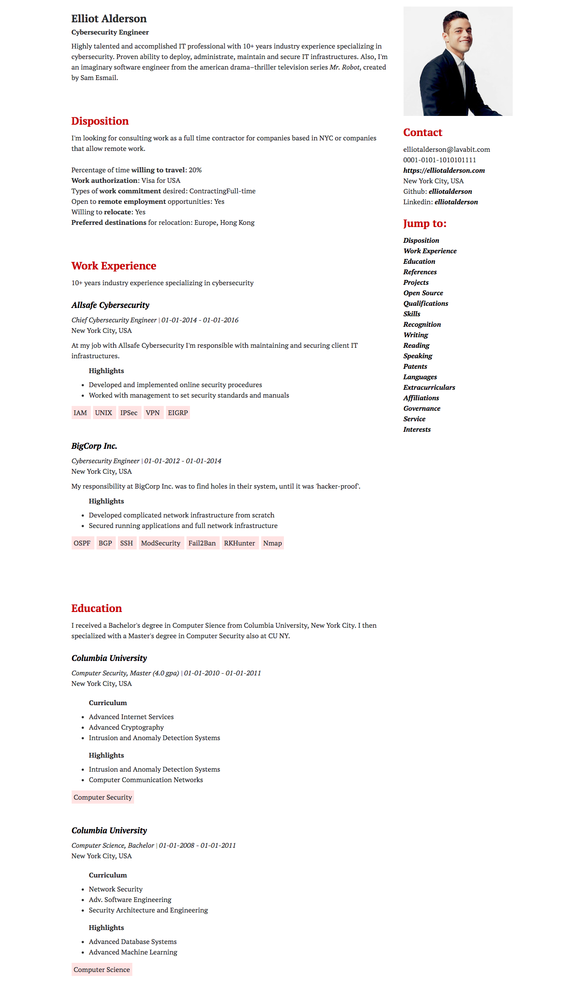

A jekyll resume template for software developers
============

A jekyll resume template for software developers, that automatically works on Github Pages.

# Setup:

1. Click [Use this template](https://github.com/wnm/resume_template/generate)
2. Name your new repository YOURUSERNAME.github.io
3. Edit [_data/resume.json](_data/resume.json)
4. Done. Your resume should automatically be deployed by Github Pages, and is hosted at https://yourusername.github.io

For example:
- My user name is [wnm](https://github.com/wnm/)
- My resume repo name is [wnm.github.io](https://github.com/wnm/wnm.github.io)
- My resume url is [https://wnm.github.io](https://wnm.github.io/)

# Demo:
(click on image to see all sections)

<h3 align="center">
  
</h3>